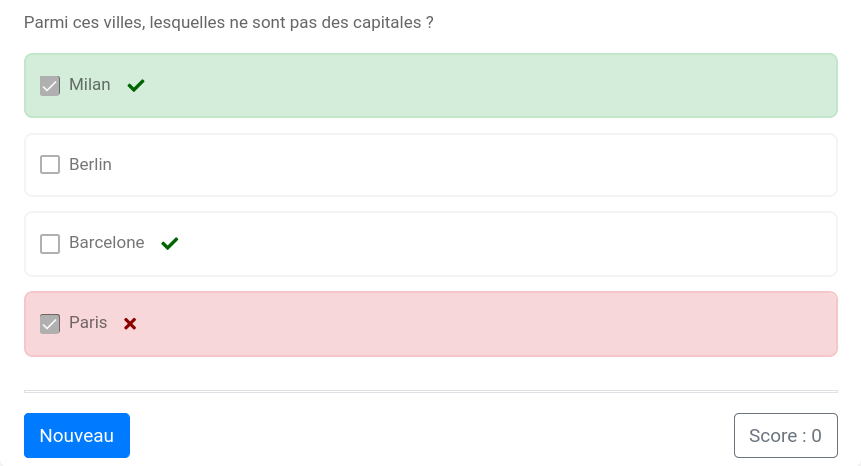

# Choix multiple (2)

Sur le même principe que le modèle `basic/radio`,  le modèle `basic/checkbox` permet de fabriquer une question à choix multiple avec plusieurs propositions sélectionnables.



Les clés de base de ce modèles sont :

  * `question` : l'énoncé de l'exercice ;
  * `items` : la liste des propositions ;
  * `indsol` : la liste des indices des bonnes réponses.

Par défaut, les propositions sont mélangées lors de la construction de l'exercice.

**Exemple 1**

```
extends = /model/basic/checkbox.pl

question ==
Parmi ces villes, lesquelles ne sont pas des capitales ?
==

items ==
Barcelone
Milan
Paris
Berlin
==

indsol = [0, 1]
```

Par défaut, le barème est `RightMinusWrong`. l'exercice renvoie le nombre de bonnes réponses sélectionnés moins le nombre de mauvaises réponses sélectionnées, le tout divisé par le nombre total de bonnes réponses et ramené entre 0 et 100.

L'autre barème est `AllOrNothing`. L'exercice renvoie un score de 100 si toutes les bonnes réponses sont sélectionnées et aucune mauvaise réponse n'est sélectionnée ; il renvoie un score de 0 sinon.

Le barème peut-être choisi grâce à la clé `scoring`.

**Exemple 2**

```
extends = /model/basic/checkbox.pl

question ==
Parmi ces villes, lesquelles ne sont pas des capitales ?
==

items ==
Barcelone
Milan
Paris
Berlin
==

scoring = "AllOrNothing"
```
