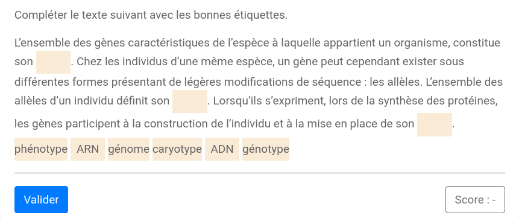

# Texte à compléter

Le modèle `basic/filltext` permet de fabriquer des exercices où il faut compléter un texte avec des étiquettes. 



Les clés de base de ce modèle sont :

  * `question` : l'énoncé de l'exercice ;
  * `filledtext` : le texte complété.

Dans `filledtext`, les parties à retrouver doivent être mises entre accolades `{...}`. Les parties à retrouver sont automatiquement transformées en étiquettes. 

La clé `labels` permet d'introduire des étiquettes supplémentaires.

**Exemple 1**

```
extends = /model/basic/filltext.pl

question ==
Compléter le texte suivante avec les bonnes étiquettes.
==

filledtext ==
L’ensemble des gènes caractéristiques de l’espèce à laquelle appartient un organisme, 
constitue son {génome}. 
Chez les individus d’une même espèce, un gène peut cependant exister sous différentes formes 
présentant de légères modifications de séquence : les allèles. 
L’ensemble des allèles d’un individu définit son {génotype}. 
Lorsqu’ils s’expriment, lors de la synthèse des protéines, les gènes participent 
à la construction de l’individu et à la mise en place de son {phénotype}. 
==

labels ==
caryotype
ADN
ARN
==
```

La clé `filledtext` supporte une mise en forme avec ses balises Markdown ou HTML.

**Exemple 2**

```
extends = /model/basic/filltext.pl

question ==
Compléter les phrases suivantes avec les étiquettes proposées.
==

filledtext ==
* Je voudrais {ces} chausures pour mon anniversaire.
* Tu est toujours en retard, {c'est} agaçant !
* Je n'aime pas {ces} méthodes.
==
```
