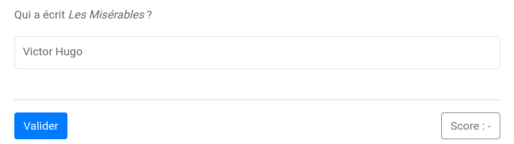

# Réponse textuelle (1)

Le modèle `basic/input` permet de fabriquer des exercices avec un champ de réponse textuel.



Les clés de base de ce modèle sont :

  * `question` : l'énoncé de l'exercice ;
  * `sol` : la liste des réponses acceptées.

Par défaut, l'évaluation de la réponse ne tient pas compte des minuscules et des majuscules. Pour n tenir compte, la clé `case` doit être mise à `True`.

**Exemple 1.** Dans cet exemple, les solutions acceptées sont `Victor Hugo`, `Hugo`, mais aussi `victor hugo`, `victor Hugo`, `HUGO`, etc.

```
extends = /model/basic/input.pl

question ==
Qui a écrit *Les Misérables* ?
==

sol ==
Victor Hugo
Hugo
==
```

La clé `tol`, qui prend un en entier positif, permet de définir une tolérance pour les réponses approximatives. Si la réponse et la solution sont égales à `tol` ajouts/suppressions/remplaçements de caractère près, la réponse est acceptée.

**Exemple 2.** Dans cet exemple, les solutions acceptées sont les chaînes égales à `Oxygène` à un ajouts/suppression/remplaçement de caractère près : `oxigène`, `oxgène`, `oxygèn`, etc.

~~~
extends = /model/basic/input.pl

text ==
Quel élément chimique a pour symbole **O** ?
==

sol ==
Oxygène
==

tol = 1
~~~
