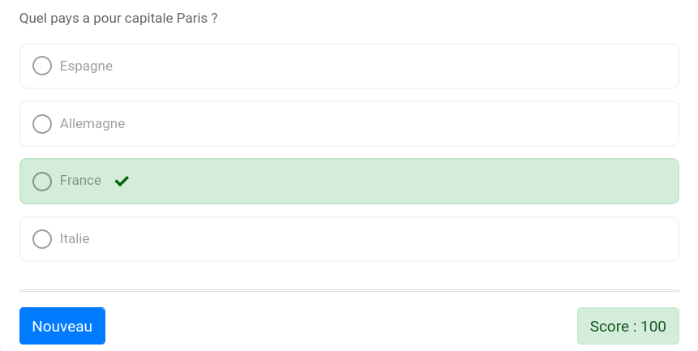

# Question à choix multiple

Le modèle qui permet de fabriquer une question à choix multiple (avec une seule proposition sélectionnable) est le modèle `basic/radio`. 



Pour choisir ce modèle dans un exercice, on commence par écrire la commande suivante.

```
extends = /model/basic/radio.pl
```

Ce modèle nécessite de renseigner au moins deux clés :

  * `question` : l'énoncé de l'exercice ;
  * `items` : la liste des propositions.
    
La liste des propositions dans `items` peut être saisie comme une liste ou, ce qui est plus pratique, comme une chaîne multilignes (chaque ligne correspondant à une proposition).

Par défaut, la première proposition est considérée comme la solution et les propositions sont mélangées lors de la construction de l'exercice.

**Exemple 1**

```
extends = /model/basic/radio.pl

question ==
Quel pays a pour capitale Paris ?
==

items ==
France
Allemagne
Italie
Espagne
==
```

Si l'on souhaite fixer l'ordre des propositions, il faut mettre la clé `shuffled` à `False`. L'ordre des propositions est alors l'ordre saisi dans la clé `items`. 

Il est ensuite nécessaire de définir la bonne réponse, qui n'est plus en général la première proposition. Pour cela, il faut entrer dans la clé `indsol` son indice dans la liste des propositions. Attention : la numérotation de la liste commence à 0.

**Exemple 2**

```
extends = /model/basic/radio.pl

question ==
A quel siècle vivait Victor Hugo
==

items ==
XVIIe siècle
XVIIIe siècle
XIXe siècle
XXe siècle
==

shuffled = False

indsol = 2
```
