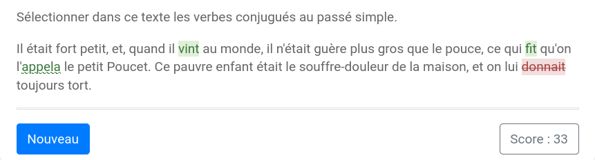

# Texte à sélectionner

Le modèle `basic/seltext` permet de fabriquer des exercices où il faut sélectionner des unités (mots, groupes de mots, etc.) dans un texte. 



Les clés de base de ce modèle sont :

  * `question` : l'énoncé de l'exercice ;
  * `seltext` : le texte à sélectionner.

Dans la clé `seltext` les unités à sélectionner doivent être marquées entre accolades `{...}`. 

Par défaut, les unités sélectionnables sont les mots du texte (les mots au sens formel, c'est-à-dire, les blocs de lettres séparés par des espaces, tirets, apostrophes).


**Exemple 1**

```
extends = /model/basic/seltext.pl

question ==
Sélectionner dans ce texte les verbes conjugués au passé simple.
==

seltext ==
Il était fort petit, et, quand il {vint} au monde, 
il n'était guère plus gros que le pouce, 
ce qui {fit} qu'on l'{appela} le petit Poucet. 
Ce pauvre enfant était le souffre-douleur de la maison, 
et on lui donnait toujours tort.
==
```

Si l'on veut définir d'autres unités sélectionnables que les mots, il suffit de les entourer de crochets `[...]`. Les parties du texte hors crochets restent découpées en mots.

**Exemple 2**

```
extends = /model/basic/seltext.pl

question ==
Sélectionner dans ce texte les mots ou groupes de mots qui désignent Van Gogh.
==

seltext == 
En 1888, {Vincent Van Gogh} peint [«Nuit Etoilée»]. 
Il est difficile de représenter [la nuit] [en couleurs].
{L'artiste} installait [son chevalet] lorsque [la nuit] tombait.
Mais comment peindre sans lampadaire ? 
{Le peintre} a eu pour cela [une idée lumineuse]. 
On dit qu'{il} a planté [des bougies] sur [le rebord] de [son chapeau]. 
{L'homme} a ainsi pu peindre grâce [aux minuscules flammes].
==
```
