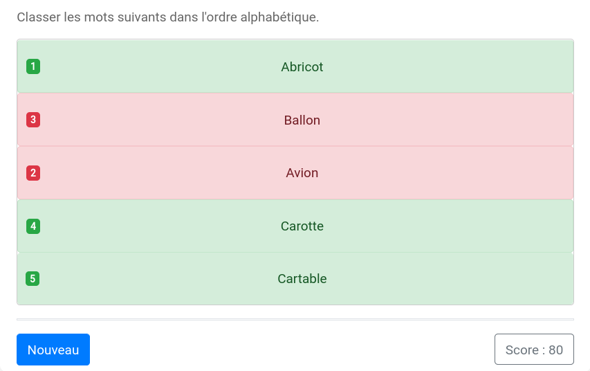

# Liste à ordonner

Le modèle `basic/sortlist` permet de fabriquer des exercices où il faut ordonner une liste. 



Les clés de base de ce modèle sont :

  * `question` : l'énoncé de l'exercice ;
  * `sortedlist` : la liste ordonnée.

**Exemple 1**

```
extends = model/basic/sortlist.pl

question ==
Classer les mots suivants dans l'ordre alphabétique.
==

sortedlist ==
Abricot
Avion
Ballon
Carotte
Cartable
==
```

Par défaut, le score repose sur une mesure de distance entre listes ([distance tau de Kendall](https://fr.wikipedia.org/wiki/Tau_de_Kendall)). Pour un barème où seul l'ordre exact est récompensé, la clé `scoring` doit être mise à `ExactOrder`.

Pour introduire de l'aléa dans l'exercice, on peut entrer une liste longue dans `sortedlist` et fixer un nombre d'items à tirer dans cette liste grâce à la clé `nbitems`.

**Exemple 2**

```
extends = /model/basic/sortlist.pl

question ==
Classer ces premiers ministres de la Ve République du plus ancien au plus récent 
(selon la date d'entrée en fonction).
==

scoring = "ExactOrder"

nbitems = 5

sortedlist ==
Michel Rocard
Édith Cresson
Édouard Balladur
Alain Juppé
Lionel Jospin
Jean-Pierre Raffarin
Dominique de Villepin
François Fillon
Jean-Marc Ayrault
Manuel Valls
Bernard Cazeneuve
Édouard Philippe
Jean Castex
==
```
