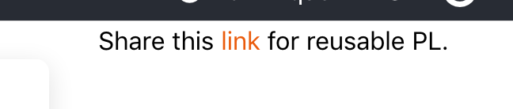

# Pour proposer un exercice en mode anonyme

Dans l'éditeur placez vous dans le répertoire de votre fichier monfichier.pl, puis
utilisez le bouton **Test** sur ce fichier.

Une nouvelle fenêtre s'ouvre avec une prévisualisation de l'exercice. Remarquez en haut a droite,
un lien supplémentaire qui pointe vers une version sauvegardée en base. Vous pouvez fournir ce lien 
à vos interlocuteurs qui pourront le visiter, qu'ils soit connectés ou non à la plateforme.

Cette innovation permet de partager avec le plus grand nombre des exercices de PL.

