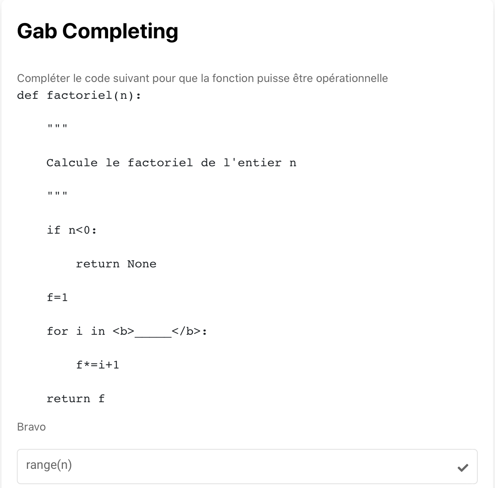

# Gab Completing 

Exo ouvert où la réponse est rentré par l'élève et le résultat immédiatement obtenus.  

Après validation de la réponse : 
✓ -> réponse correcte 
x -> réponse fausse

Cliquer sur l'image suivante pour tester : 

[](https://pl.u-pem.fr/filebrowser/demo/33559/)

Voici le code de l'exemple : 

```{r}

extends = /gift/templates/qshortset.pl

title==
Gab Completing
==

text==#|markdown|
Compléter le code suivant pour que la fonction puisse être opérationnelle

    def factoriel(n):

        """

        Calcule le factoriel de l'entier n

        """

        if n<0:

            return None

        f=1

        for i in <b>_____</b>:

            f*=i+1 

        return f 

== 


choices==
=range(n) #Bravo
== 

```

Il suffit de changer le titre (**title**), le texte (**text**) pour mettre l'énoncé de l'exercice et les choix disponibles pour les réponses justes (**choices**).

#... après la formule sur la même ligne pour mettre le commentaire à afficher après validation si la réponse est juste.

**Syntaxe :**
- <b>_____</b> à la place de l'expression à compléter
- =*bonne réponse* #*commentaire* dans la balise **choices**

*!NB : Respecter la syntaxe de PlaTon lors de l'édition du titre, de l'énoncé et des choix.*
