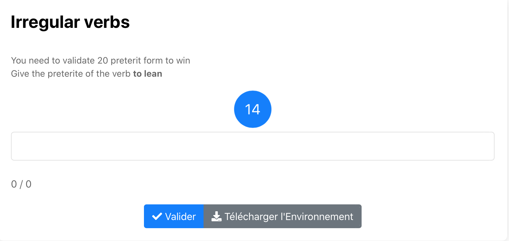

# Irregular verbs csv

Exo à questions ouvertes. L'élève doit trouver le preterit du verbe irrégulier qui lui est proposé en 15s chronométré. 
Il ne réussira l'exercice qu'après avoir trouvé 20 verbes et la note sera en fonction du nombre d'essaie.  
Après chaque réponse, si elle est juste on dit bravo sinon on donne la réponse. 

Cliquer sur l'image suivante pour tester : 

[](https://pl.u-pem.fr/filebrowser/demo/34912/)

Voici le code de l'exemple : 

```{r}
extends= /AAAA/Anna/Irregular_verbs_csv_template.pl

title=Irregular verbs

text== 
You need to validate 20 preterit form to win 

Give the preterite of the verb **to {{ verb }} **
==

@ /AAAA/Anna/Irregular_verbs.csv [data]
@ /AAAA/Anna/Irregular_verbs2.csv [data1]
==
```
Il suffit de changer le titre (**title**), le texte (**text**) pour mettre l'énoncé de l'exercice et de déclarer les fichiers csv à importer sous la forme 
**@ chemin vers le fichier pour chaque fichier**.

*!NB : Respecter la syntaxe de PlaTon lors de l'édition du titre, de l'énoncé et des fichiers **csv** à importer.*
