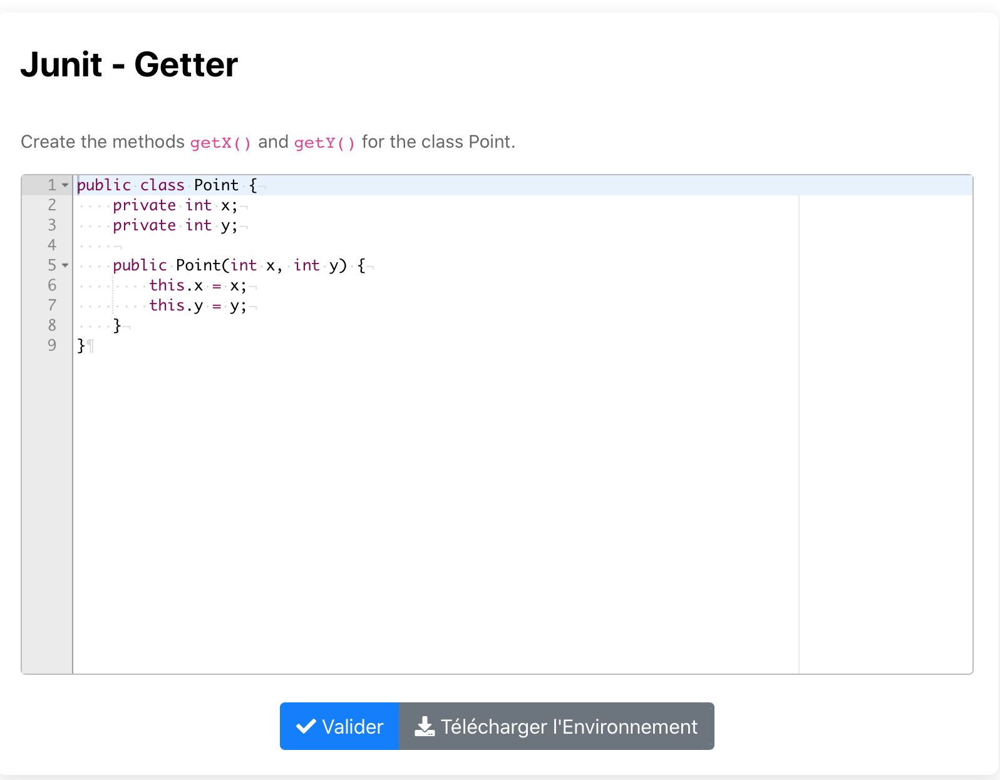

# JAVA - JUNIT - GETTER

Exo pour tester la notion de "getter". On peut utiliser le modèle pour faire écrire à l'élève n'importe
quelle autre méthode d'une classe donnée. 

On impose le nom de la classe par la balise **classname** et le nom de la méthode voulu dans la consigne 
écrite dans la balise **text**. Le titre est défini dans la balise **titre**.

On définit dans la balise **junit** la classe test pour tester l'exactitude du code fourni par l'étudiant 
sans oublier les importations nécessaires.

**Résultat obtenus après validation : (S'adapte tout seul en fonction du modèle)**
-> ✔ si valide
-> x si invalide
╷
├─ JUnit Jupiter ✔ 
│  └─ Point Test ✔   /* Class test*/
│     ├─ Get X ✔    /* Méthode test de la méthode Get X*/
│     └─ Get Y ✔    /* Méthode test de la méthode Get Y*/
└─ JUnit Vintage ✔

Test run finished after 174 ms
[         3 containers found      ]
[         0 containers skipped    ]
[         3 containers started    ]
[         0 containers aborted    ]
[         3 containers successful ]
[         0 containers failed     ]
[         2 tests found           ] /* Tests définis dans la classe Test de la balise junit */
[         0 tests skipped         ] /* Tests sautés */
[         2 tests started         ] /* Tests passés */
[         0 tests aborted         ] /* Tests interrompus */
[         2 tests successful      ] /* Tests réussis */
[         0 tests failed          ] /* Tests échoués */

Cliquer sur l'image suivante pour tester : 

[](https://pl.u-pem.fr/filebrowser/demo/33601/)

Voici le code de l'exemple : 

```{r}

extends = /template/java.pl

title = Junit - Getter
text = Create the methods `getX()` and `getY()` for the class Point.

classname = Point
before=
editor.code==
public class Point {
    private int x;
    private int y;
    
    public Point(int x, int y) {
        this.x = x;
        this.y = y;
    }
}
==

junit==
import org.junit.jupiter.api.*;
import org.junit.jupiter.api.Assertions;

@DisplayName("Point Test")
class PointTest {
    
    @Test
    @DisplayName("Get X")
    void testGetX() {
        var p = new Point(2, 3);
        Assertions.assertEquals(p.getX(), 2);
    }

    @Test
    @DisplayName("Get Y")
    void testGetY() {
        var p = new Point(2, 3);
        Assertions.assertEquals(p.getY(), 3);
    }
}
==

```

*!NB : Respecter la syntaxe de PlaTon lors de l'édition du titre, de l'énoncé et des choix.*
