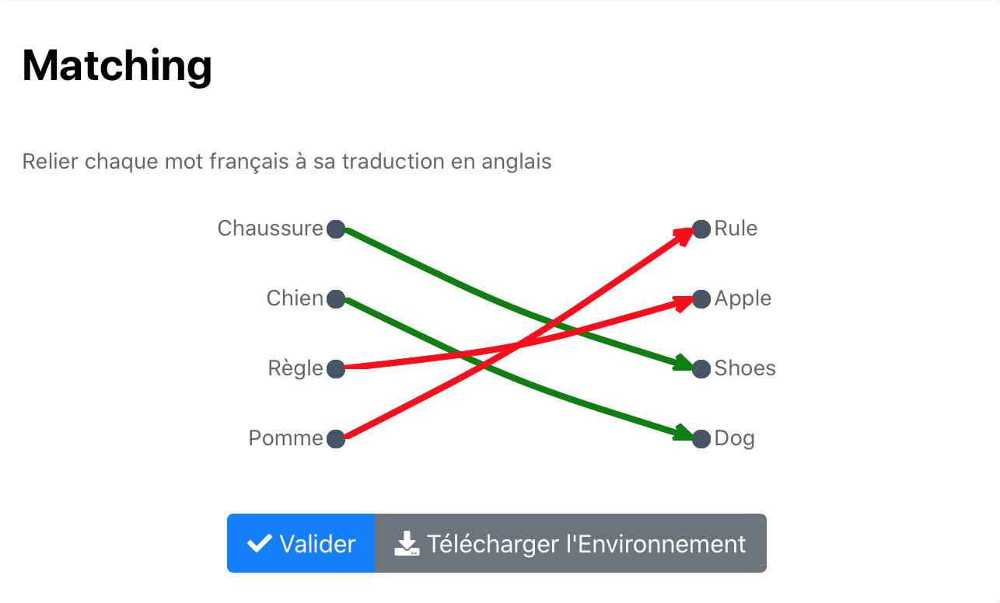

# Matching

Exos à choix unique où on doit relier chaque élèment de la première case à un élèment de la seconde case. 
Code couleurs : Après validation de la réponse 
-> Flèches vertes = réponses justes
-> Flèches rouges = réponses fausses

Pour effacer une flèche il suffit de cliquer sur le point de départ de cette même flèche (point devant colonne gauche).

Cliquer sur l'image suivante pour tester : 

[](https://pl.u-pem.fr/filebrowser/demo/33520/)

Voici le code de l'exemple : 

```{r}
extends= /AAAA/dominique/simplematchlist.pl


title==
Matching
==

text==
Relier chaque mot français à sa traduction en anglais
==

delimiter % "->"
delimiter= ->

pairs==
Pomme -> Apple
Chien -> Dog
Règle -> Rule
Chaussure -> Shoes
==
```

Il suffit de changer le titre (**title**), le texte (**text**) pour mettre l'énoncé de l'exercice et les choix dans les deux colonnes (**choices**).

Les choix de la première colonne à gauche de la flèche (**->**) et ceux de la seconde colonne à droite.

*!NB : Respecter la syntaxe de PlaTon lors de l'édition du titre, de l'énoncé et des choix.*
