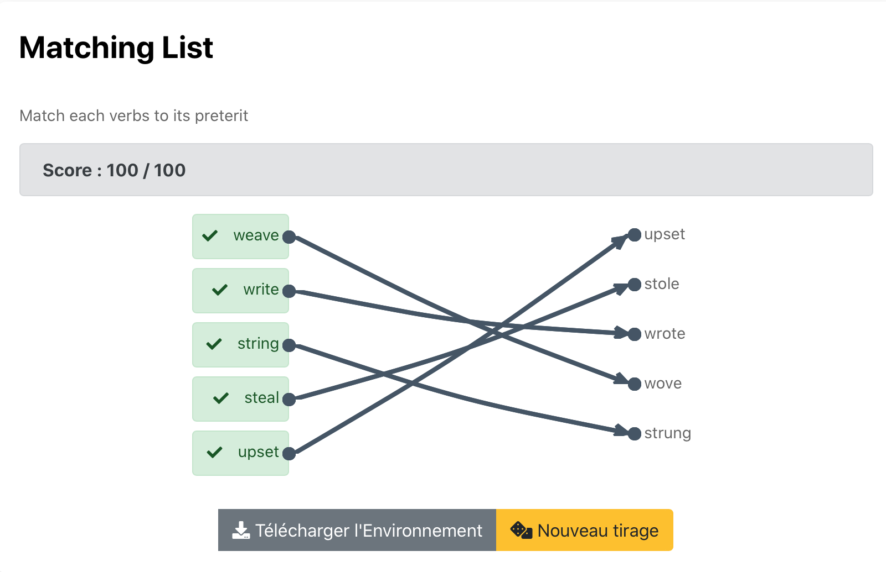

# Matching csv

Exo à choix unique où on doit relier chaque élèment de la première case à un élèment de la seconde case. 
Code couleurs : Après validation de la réponse 
-> Flèches vertes = réponses justes
-> Flèches rouges = réponses fausses

Pour effacer une flèche il suffit de cliquer sur le point de départ de cette même flèche (point devant colonne gauche).

Cliquer sur l'image suivante pour tester : 

[](https://pl.u-pem.fr/filebrowser/demo/34908/)

Voici le code de l'exemple : 

```{r}
extends= /AAAA/Anna/Matching_csv_template.pl

title==
Matching List
==

text ==
Match each verbs to its preterit
==

@ /AAAA/Anna/Irregular_verbs.csv [data]
@ /AAAA/Anna/Irregular_verbs2.csv [data1]
==
```
Il suffit de changer le titre (**title**), le texte (**text**) pour mettre l'énoncé de l'exercice et de déclarer les fichiers csv à importer sous la forme 
**@ chemin vers le fichier pour chaque fichier**.

*!NB : Respecter la syntaxe de PlaTon lors de l'édition du titre, de l'énoncé et des fichiers **csv** à importer.*
