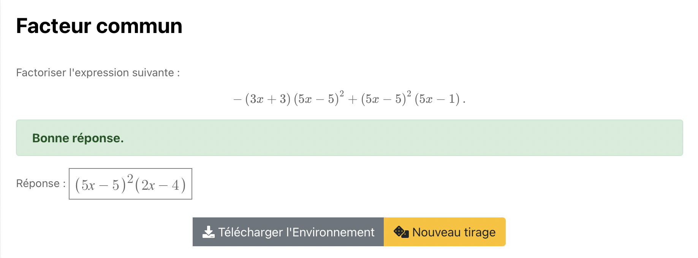

# Common factor

Exo de fatorisation ouvert où la réponse est rentré par l'élève et le résultat immédiatement obtenus.  

Après validation de la réponse : 

"Bonne réponse." en vert  -> réponse correcte 

"La réponse n'est pas égale à la solution.Une factorisation de cette expression est ..." en rouge -> réponse fausse

Cliquer sur l'image suivante pour tester : 

[](https://pl.u-pem.fr/filebrowser/option?name=test_pl&path=Yggdrasil/Mathematics/exercises/algebra/polynomials/factorization/common_factor_2terms_1_11.pl)

Voici le code de l'exemple : 

```{r}

extends = common_factor_.pl

param.nterms % 2

param.comfactor % 2

param.terms % [1,1]

param.obvious % true

```

**param.nterms** : nombre de termes pour la factorisation ( si égal à 2 par exemple nous aurons une expression de la forme A + B)

**param.comfactor** : type du facteur commun 

  -> si égal à 1, le facteur commun sera sous la forme Ax + B ou B + Ax
  
  -> si égal à 2, le facteur commun sera sous la forme (Ax + B)^2 ou (B + Ax)^2
  
  -> si égal à 3, le facteur commun sera sous la forme (Ax^2 + Bx) ou (Bx + Ax^2)

**param.terms** : type des autres termes

**param.obvious** : facteur commun évident ou non (non-évident veut dire que le facteur commun apparaîtra avec des facteurs multiplicatifs différents ; (x-2)(x+3)+(2x-4)(2x-1) par exemple)

*!NB : Respecter la syntaxe de PlaTon lors de l'édition du titre, de l'énoncé et des choix.*
