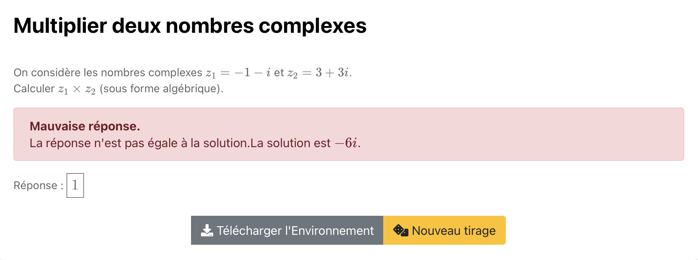

# Complex multiplication

Exo ouvert où la réponse est rentré par l'élève et le résultat immédiatement obtenus.  

Après validation de la réponse : 

"Bonne réponse." en vert  -> réponse correcte 

"Mauvaise réponse. La réponse n'est pas égale à la solution.La solution est ..." -> réponse fausse

Cliquer sur l'image suivante pour tester : 

[](https://pl.u-pem.fr/filebrowser/option?name=test_pl&path=Yggdrasil/demo/math/complex/complex_mul.pl)

Voici le code de l'exemple : 

```{r}

extends = /model/math/complex.pl

title = Multiplier deux nombres complexes

before ==
z1 = randint(-3, 3, [0]) + randint(-3, 3, [0])*I
z2 = randint(-3, 3, [0]) + randint(-3, 3, [0])*I
sol = (z1 * z2).expand()
==

text ==
On considère les nombres complexes $! z_1 = {{ z1|latex }} !$ et $! z_2 = {{ z2|latex }} !$. 

Calculer $! z_1 \times z_2 !$ (sous forme algébrique).
==

complex_form = cartesian

```

Il suffit de changer le titre (**title**), le texte (**text**) pour ajuster l'énoncé de l'exercice. Il faudra aussi définir les choix possibles pour les deux complexes à multiplier z1 et z2 ainsi que la solution sol dans la balise **before**.

*!NB : Respecter la syntaxe de PlaTon lors de l'édition du titre, de l'énoncé et des choix.*
