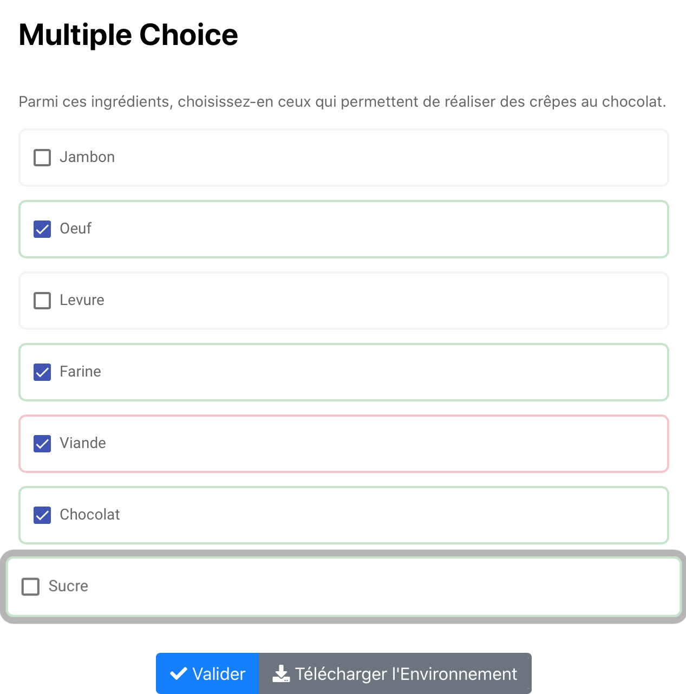

# Multiple Choice

Exo à choix multiple où on peut choisir une ou plusieurs réponses dans celles proposées. 

Code couleurs : Après validation de la réponse 

-> Cases vertes = réponses justes

-> Cases rouges = réponses fausses

Si la case devrait être coché mais ne l'est pas alors il se mettra en valeur sour forme d'animation et sera de couleur verte. 

Cliquer sur l'image suivante pour tester : 

[](https://pl.u-pem.fr/filebrowser/demo/33526/)

Voici le code de l'exemple : 

```{r}

extends = /gift/templates/qmultichoice.pl

title==
Multiple Choice 
==

text==
Parmi ces ingrédients, choisissez-en ceux qui permettent de réaliser des crêpes au chocolat.
==

choices==
%-100.0%Jambon
%25.0%Oeuf
%-100.0%Levure
%25.0%Farine
%-100.0%Viande
%25.0%Chocolat
%25.0%Sucre
==

```

Il suffit de changer le titre (**title**), le texte (**text**) pour mettre l'énoncé de l'exercice et les choix disponibles pour les réponses (**choices**).

On met un pourcentage avant chaque réponse pour indiquer si elles sont complètement fausses (-100%) ou partiellement ou à quel degré elles sont justes (100% s'il y'a une seule réponse juste; s'il y'en a plusieurs, répartir le pourcentage sur les différentes réponses justes de telle sorte que la somme fasse 100%).

*!NB : Respecter la syntaxe de PlaTon lors de l'édition du titre, de l'énoncé et des choix.*
