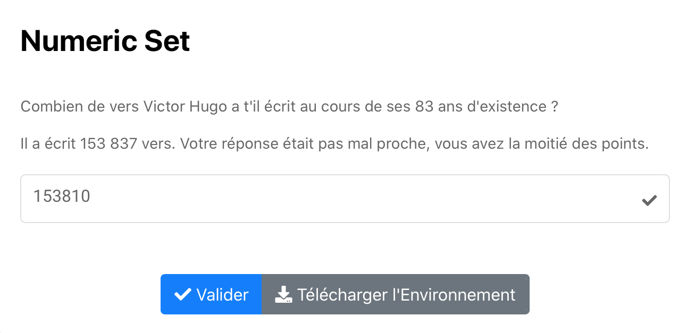

# Numeric Set (GIFT)

Exo ouvert où la réponse est rentré par l'élève et le résultat immédiatement obtenus. On peut noter selon un interval 
d'exactitude de la réponse. 

La syntaxe utilisée est celle de [GIFT](https://docs.moodle.org/3x/fr/Format_GIFT) pour les **Questions à réponse numérique**.


Après validation de la réponse : 
✓ -> réponses correctes ou partiellement correctes
x -> réponses complètement fausses 

Cliquer sur l'image suivante pour tester : 

[](https://pl.u-pem.fr/filebrowser/demo/33534/)

Voici le code de l'exemple : 

```{r}

extends = /gift/templates/qnumericset.pl

title==
Numeric Set
==

text==
Combien de vers Victor Hugo a t'il écrit au cours de ses 83 ans d'existence ?
==

choices==
153837.0:0.0 #Bravo !Vous avez tous les points.
%50.0%153837.0:100.0 #Il a écrit 153 837 vers. Votre réponse était pas mal proche, vous avez la moitié des points.
%33.0%153837.0:500.0 #Il a écrit 153 837 vers. Votre réponse était pas mal proche, vous avez le tiers des points.
%25.0%153837.0:1000.0 #Il a écrit 153 837 vers. Votre réponse était un peu proche, vous avez le quart des points.
== 

```

Il suffit de changer le titre (**title**), le texte (**text**) pour mettre l'énoncé de l'exercice et les choix disponibles pour les réponses (**choices**).

On met un pourcentage avant les réponses qui sont partiellement justes pour indiquer le degré de justesse. Si la réponse est totalement juste on ne met pas de pourcentage et l'élève obtiendra la totalité des points s'il trouve cette réponse. 

#... après la formule sur la même ligne pour mettre le commentaire à afficher après validation si la réponse est complètement ou partiellement juste.

**Autres Syntaxes que celle sur l'exemple :**

- 1..5 pour indiquer les nombres entre 1 et 5
- 3.0:2.0 pour aussi indiquer les nombres entre 1 et 5 (3 - 2 = 1 et 3 + 2 = 5)

*!NB : Respecter la syntaxe de PlaTon lors de l'édition du titre, de l'énoncé et des choix.*
