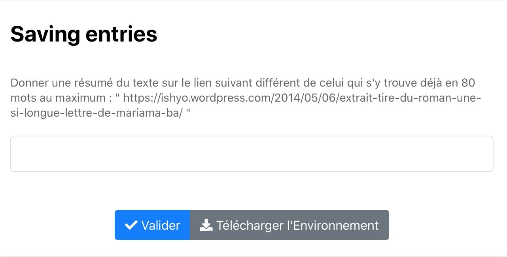

# Saving Entries

Ce style d'exo permet de recueillir les réponses des élèvesdans le grader. Adapté aux sondages ou aux questions ouvertes par exemple.

Cliquer sur l'image suivante pour tester : 

[](https://pl.u-pem.fr/filebrowser/demo/33514/)

Voici le code l'exemple : 

```{r}

extends= /gift/templates/qessay.pl 

title = Saving entries
text  ==
Donner une résumé du texte sur le lien suivant différent de celui qui s'y trouve déjà en 80 mots au maximum : 
" https://ishyo.wordpress.com/2014/05/06/extrait-tire-du-roman-une-si-longue-lettre-de-mariama-ba/ " 
==

```

Il suffit de changer le titre (**title**) et le texte (**text**) pour mettre l'énoncé de l'exercice. 
*!NB : Respecter la syntaxe de PlaTon lors de l'édition du titre et de l'énoncé*


