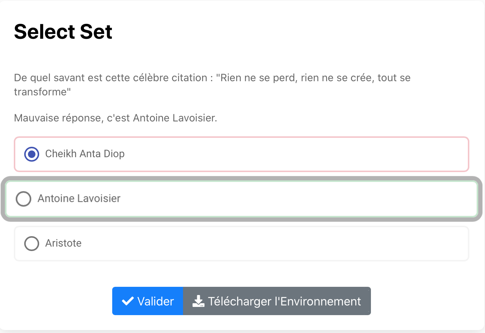

# Select Set 

Exo à choix multiple où on peut choisir une et une seule réponse parmi celles proposées. 

Code couleurs : Après validation de la réponse 
-> Case verte = réponse juste
-> Case rouge = réponse fausse

Si la case juste n'a pas été coché alors il se mettra en valeur sous forme d'animation et sera de couleur verte.  

Cliquer sur l'image suivante pour tester : 

[](https://pl.u-pem.fr/filebrowser/demo/33539/)

Voici le code de l'exemple : 

```{r}

extends = /gift/templates/qselectset.pl

title==
Select Set
==

text==
De quel savant est cette célèbre citation : "Rien ne se perd, rien ne se crée, tout se transforme"
==

choices==
~Cheikh Anta Diop #Mauvaise réponse, c'est Antoine Lavoisier.
=Antoine Lavoisier #Bonne réponse; bravo !
~Aristote #Mauvaise réponse, c'est Antoine Lavoisier.
==

```

Il suffit de changer le titre (**title**), le texte (**text**) pour mettre l'énoncé de l'exercice et les choix disponibles pour les réponses (**choices**).

**Syntaxe pour les choix :**
- = pour la réponse juste
- ~ pour les réponses fausses

*!NB : Respecter la syntaxe de PlaTon lors de l'édition du titre, de l'énoncé et des choix.*
