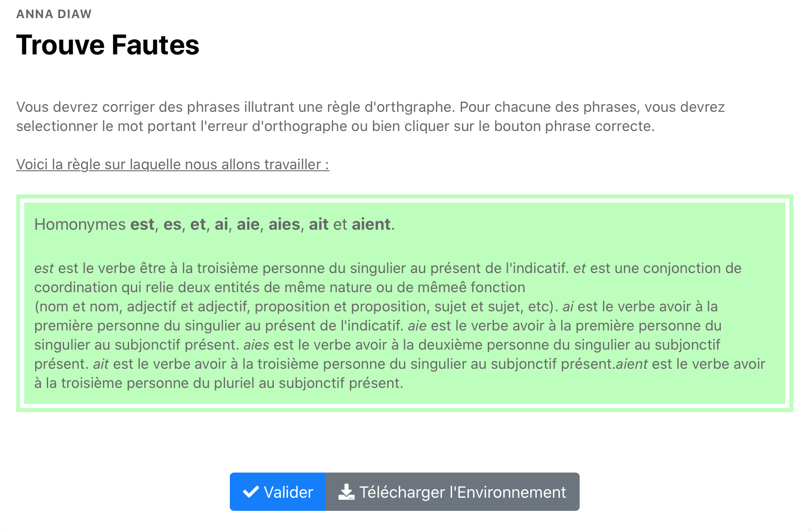

# Matching csv

Exo à clic où on doit détecter les fautes dans les phrases données selon une règle. S'il n'y a pas de faute dans la phrase fournie, on ne doit cliquer sur aucun mot 
Si la réponse est juste, on passe à la phrase suivante, sinon, on donne la réponse juste et les explications fournies par le correcteur. 

Le nombre de phrase est limité et la règle est parfois donnée avant le début de l'exercice (ici elle est donnée). 

Cliquer sur l'image suivante pour tester : 

[](https://pl.u-pem.fr/filebrowser/demo/34911/)

Voici le code de l'exemple : 

```{r}
extends = /Languages/French/Orthographe/Trouve_faute_template.pl

author = Anna DIAW

title==
Trouve Fautes    
==

text ==
Corriger les fautes d'orthographe dans les phrases suivantes ou cliquer sur correct si vous 
trouvez qu'elles sont correctes
==

@ /AAAA/Anna/Orthographe.txt 

file_list==
["Orthographe.txt"]
==

consecutive_to_validate = 4

recall_rule = True
```
Il suffit de changer le titre (**title**), le texte (**text**) pour mettre l'énoncé de l'exercice.

On importe le fichier .txt sous la forme **@ chemin vers le fichier** où se trouvent la règle en question, sa description et les exercices.
On met le nom du/des fichiers dans la balise file_liste entre crochet [].

Constitution du fichier .txt :
->règle : Enoncé de la règle
-> description : description de la règle
-> Pour chaque phrase à corriger, on définit : 
    - mauvais : la phrase avec les fautes   
    - bon : la phrase correcte 
    - explication : explication détaillée de la correction

La balise **consecutive_to_validate** permet de définir le nombre de réponses justes consécutives autorisées
pour valider l'exercice. 

La balise **recall_rule** permet de définir si on rappelle la règle en début d'exercice (True) ou pas (False).


*!NB : Respecter la syntaxe de PlaTon lors de l'édition du titre, de l'énoncé et des fichiers **txt** à importer.*
