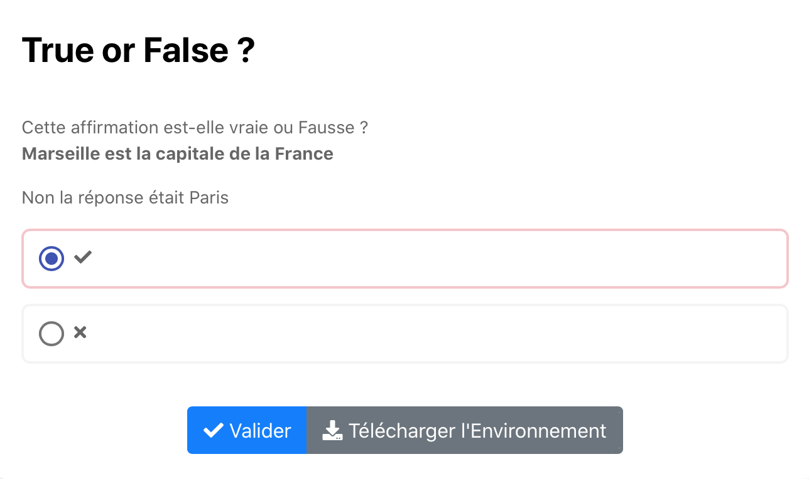

# Gab Completing 

Question à deux choix : vrai ou faux. Il s'agit de laisser à l'élève le choix d'évaluer 
si l'affirmation énoncé dans text est vraie ou fausse. 

Affichage : 

- ✓ -> Affirmation vraie
- x -> Affirmation fausse

Code couleurs : Après validation de la réponse 

- -> Case cochée verte si juste
- -> Case cochée rouge si fausse

Cliquer sur l'image suivante pour tester : 

[](https://pl.u-pem.fr/filebrowser/demo/33561/)

Voici le code de l'exemple : 

```{r}

extends = /gift/templates/qtruefalse.pl

title== 
True or False ?
==

text==#|markdown|
Cette affirmation est-elle vraie ou Fausse ? 

**Marseille est la capitale de la France**
==

# Expected answer (T or F)
answer = F

# Feedback shown when the student gives the right answer
feedback_correct==
Bonne réponse !
==

# Feedback shown when the student gives the wrong answer
feedback_wrong==
Non la réponse était Paris
==

```

Il suffit de changer le titre (**title**), le texte (**text**) pour mettre l'énoncé de l'exercice et les choix disponibles pour les réponses justes (**choices**).
Il faudra aussi définir la réponse juste par la balise **answer** et les feedback à afficher lorsque les réponses sont justes ou fausses dans les balises 
**feedback_correct** et **feedback_wrong**.

*!NB : Respecter la syntaxe de PlaTon lors de l'édition du titre, de l'énoncé et des choix.*
