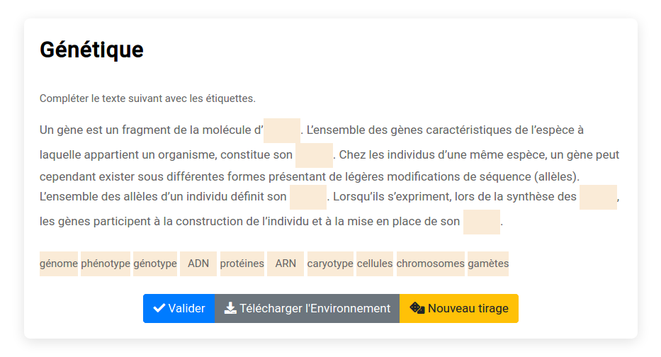

# Modèle `fillgaps`

Le modèle `fillgaps` permet de fabriquer des exercices de type *texte à trous*

## Clés du modèle

#### Clés de base
* `text` (string). Enoncé de l'exercice.
* `filledtext` (string). Texte complet. Les mots entre accolades seront remplacés par des trous.
* `distractors` (string). Etiquettes supplémentaires.

## Exemples simples

#### Génétique

~~~
extends = /model/basic/fillgaps.pl

title ==
Génétique
==

filledtext ==
Un gène est un fragment de la molécule d’{ADN}. L’ensemble des gènes caractéristiques de l’espèce à laquelle appartient un organisme, constitue son {génome}. 
Chez les individus d’une même espèce, un gène peut cependant exister sous différentes formes présentant de légères modifications de séquence (allèles). 
L’ensemble des allèles d’un individu définit son {génotype}. Lorsqu’ils s’expriment, lors de la synthèse des {protéines}, les gènes participent à la construction de l’individu et à la mise en place de son {phénotype}. 
==

distractors ==
ARN
caryotype
cellules
chromosomes
gamètes
==
~~~
