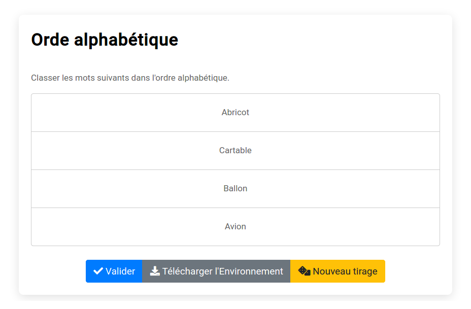

# Modèle `sortlist`

Le modèle `sortlist` permet de fabriquer des exercices où l'élève doit ordonner des items.

## Clés du modèle

#### Clés obligatoires
* `text` (string). Enoncé de l'exercice.
* `sortedlist` (string). Cette clé contient les items que l'élève devra ordonner. Elle peut-être déclarée comme une chaîne multilignes (chaque ligne correspondant à un item) ou une liste. Les items doivent y être entrés dans selon l'ordre que l'élève devra retrouver (l'exercice se chargeant de les mélanger).
* `nbsample` (number). Si la clé `nbsample` est déclarée, la liste à ordonner par l'élève sera un échantillon aléatoire de `nbsample` items de `sortedlist`. Si la clé `nbsample` n'est pas déclarée, la liste à ordonner par l'élève contiendra tous les items de `sortedlist`.

#### Clés d'évaluation (optionnelles)
* `scoring`. Cette clé définit le barème de l'exercice. Deux barèmes sont proposés : "ExactOrder" (défaut) ou "KendallTau".

## Exemples simples

#### Ordre alphabétique

~~~
extends = model/basic/sortlist.pl

title ==
Ordre alphabétique
==

text ==
Classer les mots suivants dans l'ordre alphabétique.
==

sortedlist ==
Abricot
Avion
Ballon
Cartable
==
~~~

#### Premiers Ministres

~~~
extends = model/basic/sortlist.pl

title ==
Premiers Ministres
==

text ==
Classer ces premiers ministres de la Ve République du plus ancien au plus récent (selon la date d'entrée en fonction).
==

sortedlist @= premiers_ministres.txt

nbsample = 5

scoring = "KendallTau"

demo = https://pl.u-pem.fr/filebrowser/demo/25075/
~~~
