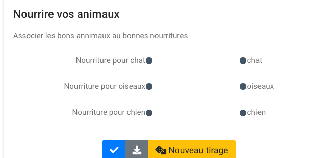

# Associations 

Exercice d'association de pairs. 

[](https://pl.u-pem.fr/filebrowser/demo/32826/)


Un premier modèle qui utilise le caractère '§' pour séparer les élèments des pairs.

```
extends = /model/matchlist/matchlist.pl

pairs ==
Nourriture pour chat§chat
Nourriture pour chien§chien
Nourriture pour oiseaux§oiseaux
==

text = Associez les bons annimaux aux bonnes nourritures  

title = Nourrire vos animaux 
```

Un deuxième modèle qui utilise le caractère définie par la balise **delimiter** pour séparer les élèments des pairs.

A venir.
