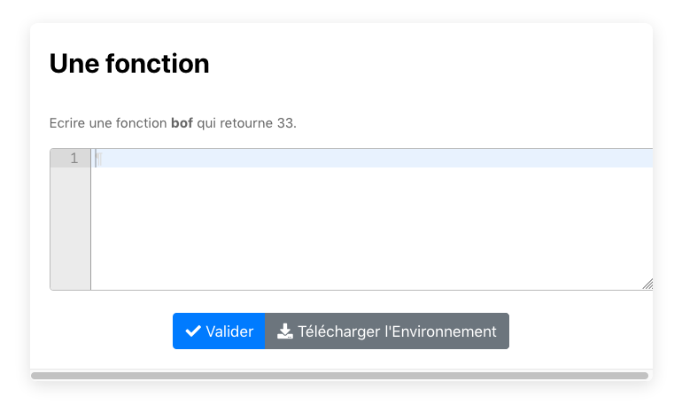

# Un template pour écrire des exercice de python en utilisant doctest

Ce template permet de faire des exercice de python en utilisant la syntaxe de doctest.

Pour cela il suffit de déclarer une balise pltest par exemple pour tester une fonction **f** qui n'a pas de paramètres et retourne la valeur 42. 

    extends=/ComputerScience/python/AP1-1920/templates/pltest.pl
    title= Une fonction qui répond à **LA question**
    text==
    Ecrire une fonction **f** sans paramètre qui retourne l'entier 42.
    ==
    pltest==
    >>> f == f # La fonction existe  ?
    True
    >>> f() # f retourne ou affiche  42
    42
    >>> f() == 42 # retourne 42 
    True
    ==

Chaque ligne du doctest est considéré comme un test et produira un affichage correpondant dans le feedback.

Si vous voulez plusieurs groupes de test vous notez pltest1 puis pltest2 etc 

    pltest1==
    Le test suivant sera affiché telquel à l'étudiant 
    >>> f != f
    True
    
    ET sera biensur toujour faux
    le test suivant ne sera affiché que si il cause une erreur et seulement l'erreur sera affiché
    >>> f==f #
    True

    le test suivant affichera le text qui suit le #
    >> f == f # Bande de moules 
    True
    ==

Si vous souhaitez faire des tests sur le code de l'élève la variable __student__ est accessible dans le pltest

    pltest2==
    >>> student.count("if")>1 # Trop de tests IF 
    False
    ==

Les **pltest** puis **pltest0-9** sont exécutés dans l'ordre.

Pour que les tests s'arrète sur la première erreur :

    stopfirsterror=True # Valeur par defaut (True)

Si vous souhaiter utiliser un "before" vous devez ajouter:

  @ /builder/before.py [builder.py]

Vous pouvez aussi ajouter un "after" qui est exécuté après les pltests.

      after==
      if grade[0]==100:
          grade[1]=" Vraiment Bravo" 
      ==

