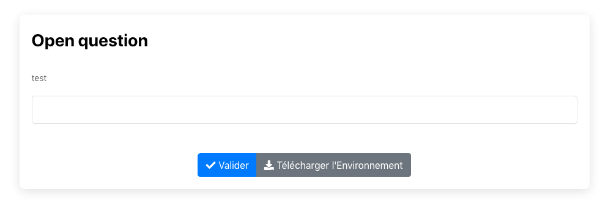

# Question Ouverte 

Les questions ouvertes sont possible mais pour le moment 20/11/2020 seul les adminstrateurs peuvent récupérer les réponses des élèves.

Si vous en avez besoin contacter un administrateur: dr@univ-mlv.fr avant de vous lancer.

Clicker sur l'image pour tester: 
[](https://pl.u-pem.fr/filebrowser/demo/32667/)

Voici le code de l'exemple :

```
extends = /gift/templates/qessay.pl

title= Open question
text==
test
==
```
Vous pouvez modifier le titre (title) et l'énoncé (text) en respectant la syntaxe usuelle de PL.

