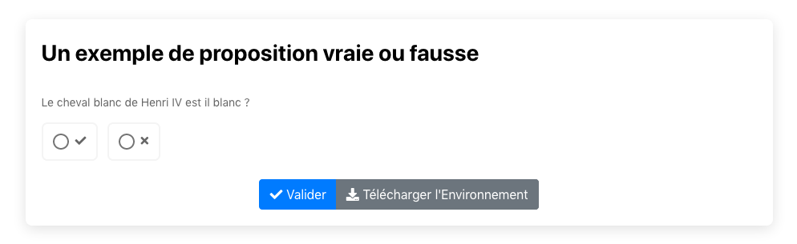

# Vraie ou fausse

Tester une affirmation au près de vos étudiants.

[](https://pl.u-pem.fr/filebrowser/demo/32678/)


Le code de l'exemple 
```
extends = /model/basic/vraifaux.pl

title= Un exemple de proposition vraie ou fausse 

text==
Le cheval blanc de Henri IV est il blanc ? 
==


answer=Non


# pour aligner les propositions 
horizontal % true 

feedback_correct ==
Bien vu il est gris car il s'est roulé dans la poussière.  

==
feedback_wrong = Il vous manque des informations.
general_feedback==


Bien entendu c'est une question piège.
==

```

# Variables modifiables:

   title: le titre   
   text: l'énoncé de la proposition   
   answer: la solution si la proposition est vraie (T,True,true,yes,oui),  ou fausse(F,faux,false,non,no).  
   horizontal % true si l'affichage des deux boutons est horizontal ou vertical (remarque il faut %false ou %true comme valeur). 
   feedback_correct: le feedback quand la réponse est correcte   
   feedback_wrong : le feedback quand la réponse est incorrecte   
   general_feedback: le feedback dans les deux cas   
   

