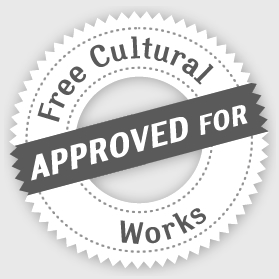

# Présentation de PLaTon

**PLaTon** est un projet universitaire open source ayant pour objectif le développement
d'une plateforme assistant l'expérience pédagogique des enseignants et des apprenants.
Outre une partie orientée exerciseur, **PLaTon** veut aussi proposer du conseil, faire 
du monitoring des apprentissages, aider à la cohérence des activités pédagogiques. C'est 
un assistant à l'apprentissage pour les enseignants planificateurs et rédacteurs des 
activités pédagogiques mais aussi des apprenants.

## Historique

La page [Histoire de la génèse du projet PLaTon](histoire.md) vous proposera un résumé 
des motivations et des constats qui ont poussé à la génèse de la plateforme **PLaTon**.

## Notre philosophie

Nous développons **PLaTon** parce qu'aucun outil open source existant ne pouvait s'adapter 
à nos besoins. Voici les principaux objectifs qui conditionnent nos actions et influencent
nos décisions.

* Promouvoir la réutilisabilité.
* Assimiler toutes les ressources assimilables ou interopérables.
* Prévoir l'assimilation par autrui de nos ressources.
* Ressources pédagogiques libres et gratuites.
* Corrections, validations et currations des ressources effectuées socialement et par les pairs.
* Aucune restriction de publication, tout le monde peut produire.
* Mettre en place une station permettant la collégialité de produire à pleine puissance.
* Proposez autant de niveau de langage que nécessaire dans les ressources.
* Respecter la RGPD, l'éthique et la déontologie des métiers de l'enseignement.

Vous pouvez <a href="https://github.com/PremierLangage/PLPR/raw/master/PL_dev_philo.pdf" target="blank">télécharger ici</a>
une ancienne présentation (du 20 Janvier 2019, ainsi avant COVID...) des motivations 
organisationnelles et techniques du projet **PLaTon**.

## Licences

Le coeur de la plateforme est publié sous la licence 
<a href="https://github.com/PremierLangage/premierlangage/blob/master/LICENSE" target="blank">CeCILL-B</a>. Cette 
licence franco-française possède globalement les caractéristiques des licences BSD. Nous 
encourageons les enseignants à produire leur ressources sous le joug de la licence
<a href="https://creativecommons.org/licenses/by-sa/3.0/fr/" target="blank">CC-By-SA 3.0</a> 
qui est actuellement une référence pour les travaux estampillés **free cultural works**.

## Contribuer au projet

La page [Comment contribuer au projet PLaTon](contribuer.md) vous explique comment 
participer au développement du projet **PLaTon**. Comme les besoins sont extrêmement
divers, quelques soit vos compétances originelles, vous devriez facilement pourvoir 
apporter votre pierre à l'édifice, quelque soit la taille de cette pierre.

## Sponsors

Les institutions suivantes ont contribuées finacièrement ou en services pour le 
développement de la plateforme open source **PLaTon**.

