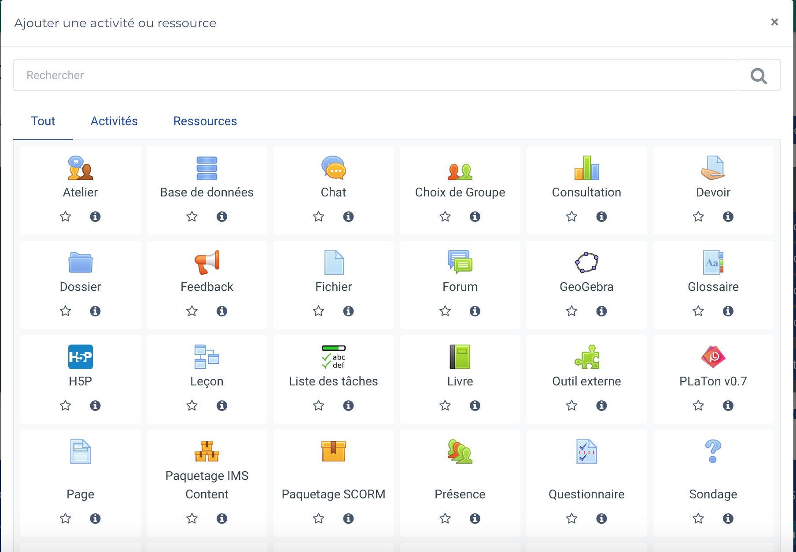

  # CREER PLATON UN COURS À PARTIR DE MOODLE
  
  Les cours sur PlaTon sont créés automatiquement lorsqu'il existe au moins une activité PlaTon dans ce cours sur Moodle.
  
  ## Comment créer une activité PlaTon sur Moodle ?
  
  Notons qu'il faut avoir le statut d'enseignant dans le cours en question pour pouvoir l'éditer et ainsi créer des activi†és dans le cours. 
 
 
 
 1. Activer le mode édition par le bouton en haut à droite de la page
 
 

2. Ajouter une activité en cliquant sur le bouton ajouter une activité ou ressource à droite en bas de la page

 
 
3. Choisir l'outil PlaTon v0.7 puis remplir le formulaire suivant. 
 
 
Champs à remplir : 
  - Nom de l'activité 
  - URL de l'outil : mettre l'url vers l'activité PL que l'on obtient en cliquant sur le bouton load à droite du fichier .pltp de l'activité sur l'éditeur de ressources PL 
 

4. Enrégistrer par l'un de ces deux boutons en bas de pages

L'activité s'affichera de cette manière en fin de liste des activités du cours sur la page du cours en question. 
 
