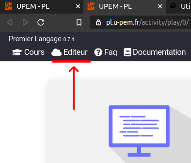

# L'éditeur de ressource de **PLaTon**

Voici comment rejoindre l'éditeur de ressources.

## Informer PLaTon que vous êtes un enseignant

Voici comment rejoindre votre serveur **PLaTon** avec le bon statut : 

* Si vous avez accès à un serveur **PLaTon**. Une première chose à faire est de vous 
  dirigez vers votre LMS ( voir [[lms]] ) et de vous inscrire ou bien de vous faire 
  inscrire sur un cours, pointant vers une activité **PLaTon**, avec le status d'enseignant. 

* Ceci fait, logguez vous à votre LMS ( voir [[lms]] ), allez sur le cours dont 
  vous êtes aussi un enseignant et cliquer sur l'activité **PLaTon**.

* Cette première connexion avec le status d'enseignant va mettre à jour votre
  profil **PLaTon** qui vous proposera via un lien en haut de l'interface de
  rejoindre l'éditeur.

!!! Note
    Pour avoir accès à l'éditeur de ressources, il faut et il suffit 
    d'être inscrit à un cours **PLaTon** avec le role d'enseignant.

Pour faciliter cette procédure, nous vous conseillons la création d'une matière 
fictive **PLaTon** sur votre LMS ( voir [[lms]] ) en inscription libre à vos 
enseignants avec le status d'enseignant. Ainsi, tous les enseignants de votre 
institution pourront s'inscrire sur votre serveur **PLaTon** en autonomie.

!!! Attention
    Les comptes administrateurs peuvent aussi donner le rôle d'enseignant aux 
    utilisateurs via l'administration de Django. Nous ne conseillons pas de 
    faire cette tâche à la main. Une fois un serveur installé, l'administrateur
    à tout intérêt à créer un cours fictif comme décrit au dessus et à limiter
    des actions d'édition directe sur la base de donnée.
    
    
## L'éditeur intégré

Si vous avez suivi une procédure issue de la première section. Il vous suffit 
alors de vous diriger vers n'importe quelle activité du serveur **PLaTon**
auquelvous avez accès. Une fois dans **PLaTon**, votre interface graphique,
en haut de l'écran, vous propose plusieurs onglets. Le second doit être
un lien pour vous diriger vers l'éditeur de ressources.

Une fois cliqué, vous devriez avoir quelques secondes de temps de chargement

!!! Attention
    Le navigateur internet Firefox peut présenter quelques bugs suivant sa 
    version. Nous conseillons l'utilisation d'un navigateur type chrome.
    
Vous voilà sur l'éditeur, ce dernier contient beaucoup de documenation 
intégré pour apprendre à l'utiliser efficacement.
