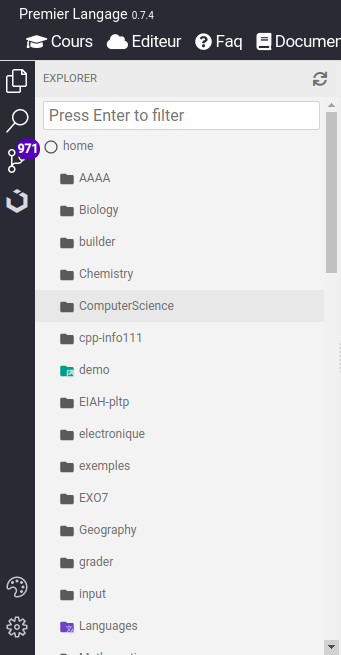
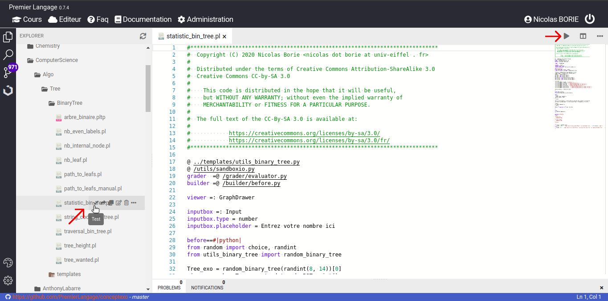
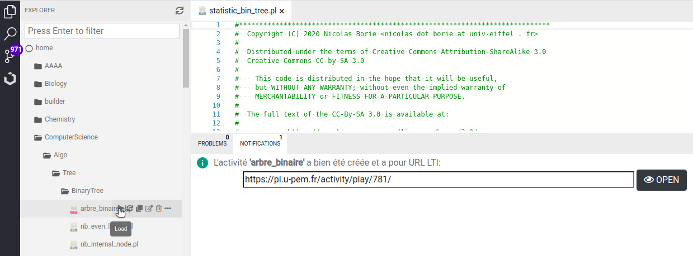

# Les fichiers pl et pltp

Il y a deux grands types de fichiers dans la base de données de ressources. Les exercices
**PLaTon** seront des fichiers d'extension pl ( exemple `nom_de_l_exo.pl` ) et les
fiches de TP rassemblant plusieurs exercices sont des fichiers d'extension pltp 
( exemple `tite_du_TP.pltp` ).

Dans la verison actuelle de **PLaTon**, les pltp consistituent les activités déployables 
devant les élèves.

## Les fichiers d'exercices

Sur la gauche de l'éditeur de ressources, par défault, vous verez l'arborscence de
toutes les ressources pédagogiques du projet **PLaTon**.

!!! Attention
    Dans cet arborsecence, on voit le travail de tout le monde. Ça permet très 
    facilement de réutiliser les choses déjà faites. Par contre, il ne faut pas 
    modifier des fichiers sans prévenir les auteurs ou propriétaires au préalable.
    
Vous pouvez tester sans risque les fichiers déjà présents (si vous ne les modifier pas...).
Pour cela, il suffit de vous déplacez dans l'arborescence en cliquant sur les répertoires
et les fichiers. Une fois que vous avez selectionné un exercice **PLaTon**, le code
source de ne dernier doit s'ouvrir dans la partie droite de l'édteur comme il suit :

Il y a alors deux boutons pour tester l'exercice : un dans l'arborescence qui apparaitra 
automatiquement au dessus du nom du fichier si vous laisser le pointeur de la souris dessus.
Ce bouton est désigné par la flèche rouge à gauche dans la capture d'écran au dessus. Tester
ainsi un exercice ouvrira un nouvel onglet dans votre navigateur, onglet qui sera  dédié 
au test de l'exercice.

L'autre bouton pour tester est le symbole play en haut à droite de l'éditeur. Ce bouton play,
un triangle pointant la droite, est désigné par l'autre flèche rouge. Tester via ce bouton va 
incruster le test de l'exercice à l'intérieur de l'éditeur 
en coupant verticelement la fenetre de l'éditeur.

!!! Note
    Tester sans modifier les fichiers ne laisse aucune trace. Il y a pas de trace dans 
    les bases de données, aucune sauvegarde. Les auteurs des exercices que vous testez 
    ne sont pas notifiés non plus. Tester permet donc de rester informé et peut vous donner 
    des idées pour vos propres enseignements.

Quand vous assemblerez votre propre TP, vous aurez tout intérêt à tester au préalable les
exercices que vous allez y insérer.

## Les fichiers de TP

Les autres fichiers forndamentaux dans la version actuelle de **PLaTon** sont les fichiers
pltp. Ouvrez en un pour en voir les sources. Gloablement, un fichier est une liste 
d'exercices plus un titre et une introduction optionnelle.

Par contre, pour les PLTP, on ne parle plus de test mais de chargement. Charger un PLTP
va fabriquer une activité autonome et fonctionnelle dans **PLaTon** accessible via un 
lien hypertext. Ce liens hypertext peut être cliqué directement (ce qui permmtra de
tester le PLTP) mais peut aussi être trasnmis à un LMS ( voir [[lms]] ) pour y intégrer
ce PLTP **PLaTon**.

Dans l'exemple au dessus, le lien généré est :   

    https://pl.u-pem.fr/activity/play/781/

Vous aurez souvent à noter ce lien (soit le liens en entier quand vous déployerez ce 
PLTP dans un nouveau cours, soit seulement le numéro final quand vous voudrez rajouter
ce PLTP dans un cours existant).

Pour votre premier déployement de cours, contacter l'administrateur de votre LMS 
( voir [[lms]] ) ou un power-user de **PLaTon** de votre institution. Les liens LTI,
notament dans moodle, se configure avec un mot de passe.
